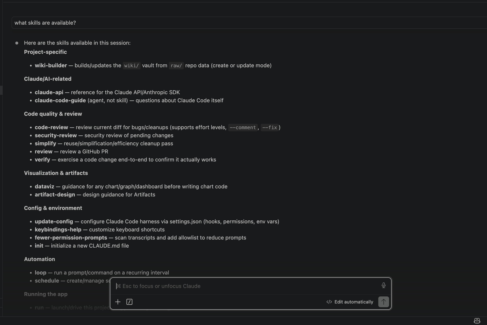
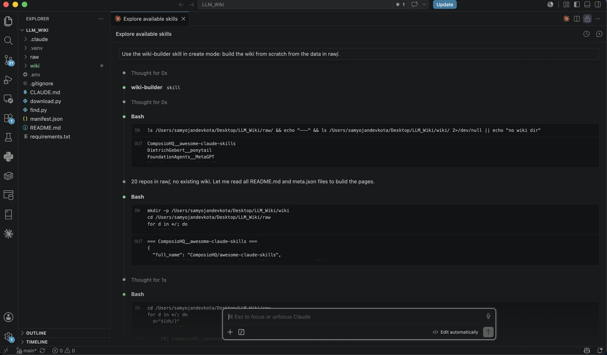
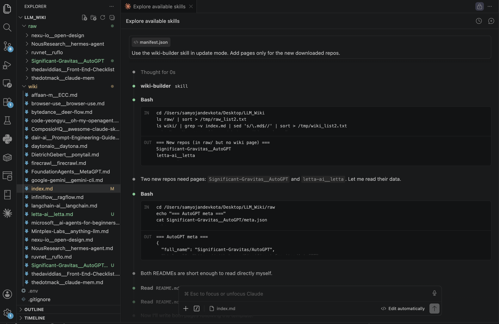
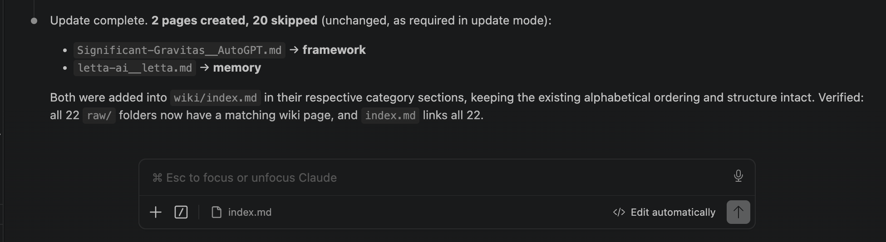

# LLM-Wiki

I built a pipeline that discovers the top AI-agent repositories on GitHub and
turns their READMEs into a Markdown knowledge vault. This was a take-home task
for Quanted: a small slice of a knowledge layer that an internal agent could
read and keep current.

Pipeline shape:

find.py -> manifest.json -> download.py (new entries only) -> raw/ -> wiki-builder skill (create | update) -> wiki/

Demo video (update flow, ~6 min): https://youtu.be/3JpK7XrNnmY

## Design in one paragraph

I followed one rule throughout: a clean split between mechanical work and LLM
work. The two Python scripts contain no LLM code of any kind. They talk only
to the GitHub REST API and the filesystem. All the intelligence, turning raw
READMEs into wiki pages, lives in a Claude Code skill. A second idea repeats
at every layer: the filesystem is the state. The downloader knows what is new
by checking which folders exist in raw/. The skill knows what is new by
comparing raw/ against wiki/. No database, no bookkeeping files that can
drift out of sync.

## 1. Discovery (find.py)

I run five GitHub search queries instead of one: two topic searches
(topic:ai-agents, topic:llm-agents) and three keyword searches covering
frameworks, orchestration, and agent memory. A single topic tag misses repos
that do not tag themselves, and the brief asked for coverage across several
sub-areas. I merge the results, deduplicate by full_name, sort by stars, and
write the top 20 to manifest.json.

I accepted two known limitations. Star counts can be inflated, so top by
stars is not top by importance. Keyword search admits some noise, for example
learning resources rather than tools. The human-editable manifest is the
counterweight: curation fixes what search gets wrong.

## 2. The manifest

manifest.json is the source of truth for what gets ingested. Each entry
carries full_name, html_url, description, stars, and default_branch. To grow
the list, a human adds an entry by hand (I demonstrate this in the video) or
re-runs find.py. One caveat: find.py currently overwrites the manifest, which
would clobber hand-added entries. See Improvements.

## 3. Incremental download (download.py)

The script reads the manifest and fetches each repo's README through the
GitHub /repos/{owner}/{repo}/readme endpoint. That endpoint returns the
README whatever it is named, base64-encoded, and I decode it to text. Each
repo gets its own folder, raw/<owner__repo>/, where the double underscore
flattens owner/repo into a safe folder name. The folder holds README.md plus
meta.json, a copy of the manifest entry, so every folder is self-contained
for the skill to read.

Incrementality works by treating the folder itself as the record: if
raw/<owner__repo>/ exists, the entry is skipped. I create the folder only
after a successful fetch, so a failed download cannot masquerade as a
completed one. A single failure logs and continues rather than aborting the
run. In the recorded update run, with two new entries in a 22-entry manifest,
the script printed: 2 downloaded, 20 skipped, 0 failed.

I committed raw/ deliberately, so a reviewer can run the skill or inspect the
inputs without doing the downloads.

## 4. The wiki-builder skill (create and update)

One skill, defined in .claude/skills/wiki-builder/SKILL.md, with two modes:

- create: read every folder in raw/, write one page per repo into wiki/ plus
  an index.md, overwriting any existing vault.
- update: compare raw/ folders against wiki/ pages, generate pages only for
  repos that have raw data but no page, and add them to the index without
  regenerating existing pages. Same filesystem-is-the-state idea as the
  downloader.

The skill fixes a rigid page template (summary, what it is, what it is good
for, key features, category) so all 20 pages come out structurally identical.
It instructs the agent to base every page only on that repo's README and
meta.json and never to invent details, which fences in hallucination. It ends
with a verification step that reports counts of pages created and skipped.

I researched the Obsidian vault format before choosing the linking style. The
index uses [[wikilinks]], Obsidian's native syntax. GitHub's file view renders
them as plain text, so open wiki/ as a vault in Obsidian for clickable
navigation. I considered standard Markdown links for GitHub readability and
kept wikilinks to stay faithful to the vault format.

## 5. Setup and running

Requirements: Python 3.10+ (I built on 3.14) and a free GitHub personal
access token with read-only public repository access.

    python3 -m venv .venv
    source .venv/bin/activate
    pip install -r requirements.txt

Token: create a .env file in the project root containing
GITHUB_TOKEN=<your token> (the file is gitignored), or export it in the
shell. The scripts support both, since load_dotenv() quietly does nothing
when no .env exists.

    python find.py        # build or refresh the manifest
    python download.py    # fetch READMEs for new entries only

For the wiki, open the project in Claude Code and invoke the skill in the
mode you want, for example "Use the wiki-builder skill in create mode" or
"Use the wiki-builder skill in update mode: add pages only for newly
downloaded repos."

## 6. How I used Claude Code

I split the agent's context into two files. CLAUDE.md carries the standing
project rules: the layout, the run commands, and the golden rule that the
Python scripts never get LLM calls. The skill carries the on-demand
procedure. CLAUDE.md describes how things are, the skill describes what to do.

For the create run, I first asked "what skills are available?" to confirm the
agent had picked up wiki-builder, then prompted: "Use the wiki-builder skill
in create mode: build the wiki from scratch from the data in raw/." The agent
surveyed raw/ first (looping over the folders and reading each meta.json),
then generated all 20 pages and the index. I did not need to redirect it. My
role was reviewing and approving each proposed action, twenty to thirty
approvals across the run, and I read each one before accepting.

For the update run, shown in the video, the skill correctly identified the
two repos with raw data but no wiki page, generated exactly those two pages,
and updated the index without touching existing pages, on the first attempt.

Transcript snippets:

Confirming the skill loaded before the run:

Kicking off create mode:

The update run and its final report:

## 7. Update flow demo

Video: https://youtu.be/3JpK7XrNnmY

Shown in the recording: I add two repos (Significant-Gravitas/AutoGPT and
letta-ai/letta) to the manifest by hand, download.py reports 2 downloaded,
20 skipped, 0 failed, the skill in update mode generates exactly two new
pages and updates the index, and the change list confirms existing pages
were untouched.

## 8. Auditing the output

After the create run I checked the vault rather than trusting the report:
20 pages plus index, filenames matching the raw/ folder names, and every
page following the template. I spot-checked the bytedance/deer-flow page
against its raw README for invented claims and found none, though I did not
verify every page line by line.

## 9. What I'd improve with more time

- Merge instead of overwrite in find.py, so discovery preserves hand-added
  manifest entries. This is the first thing I would fix: right now curation
  and re-discovery fight each other.
- Smarter discovery filters: exclude archived repos and learning resources,
  and add a minimum-stars floor.
- Fetch a few key docs beyond the README (docs/ folder, CONTRIBUTING) for
  richer wiki pages.
- A --force flag on download.py to re-fetch a repo whose README has changed,
  since folder existence currently means never re-downloading.

## What I learned

Two things stuck. First, the filesystem-as-state pattern: folder existence is
a simpler and more honest record than a separate state file, and I ended up
using it at two layers of the pipeline. Second, the value of keeping the LLM
out of the mechanical path: the GitHub API does the fetching for free with a
token, and the agent spends its effort only where judgment is needed.